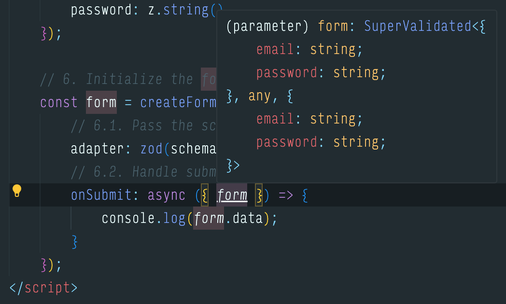
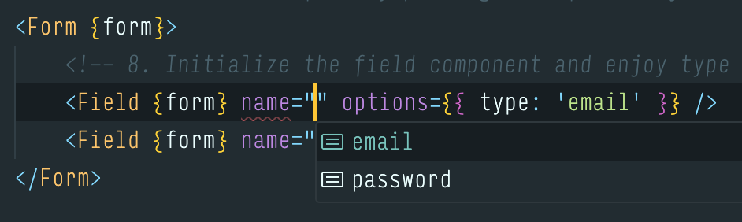

# Forms

<br />

## Overview

The forms module provides a powerful, type-safe form handling system built on top of [sveltekit-superforms](https://superforms.rocks/).

It includes:

- pre-built components for fields
- input validation
- error display per-field
- state management

<br />

> [!NOTE]
> The form module has been built for SPA use in mind, so it won't use superforms server capabilities.

<br />

## Basic setup

This is the basic setup for a form. In this example we'll use `zod` as our validation library, but all libraries supported by superforms will work.

```svelte
<script lang="ts">
    // 1. Import the `Form` component and the `createForm` function
	import { createForm, Form } from '@/forms';
    // 2. Import sample form field
	import { Field } from '@/forms/fields';
    // 3. Import zod to build the schema
    import z from 'zod'
    // 4. Import the zod adapter from `sveltekit-superforms`
    import { zod } from 'sveltekit-superforms/adapters';

    // 5. Build the schema
	const schema = z.object({
        email: z.string().email(),
        password: z.string(),
    })

    // 6. Initialize the form
	const form = createForm({
        // 6.1. Pass the schema
		adapter: zod(schema),
        // 6.2. Handle submission
		onSubmit: async ({form}) => {
            console.log(form.data)
		},
	});
</script>

<!-- 7. Initialize the form by passing the `form` object  -->
<Form {form}>
    <!-- 8. Initialize the field component and enjoy type safety!  -->
	<Field {form} name="email" options={{ type: 'email' }} />
	<Field {form} name="password" options={{ type: 'password' }} />
    <!-- 9. The submit button and the error banner are added by default  -->
</Form>
```

Here are some autocompletion examples:




<br />

## The fields

Here's a list of all the possible fields

```typescript
import {
  Field,
  FileField,
  SwitchField,
  CheckboxField,
  TextareaField,
  SelectField,
  DateField,
} from "@/forms/fields";
```

All fields have the same props:

```typescript
export let form: Superform<T>;
export let field: FormPathLeaves<T>;
export let options: FieldOptions; // This is specific for each field
```

<br />

## The form - In detail

In the sections below, we'll explore the API and the possible options.

### createForm

```typescript
const form = createForm({
    // The adapter for the schema
    adapter: zod(schema),

    // Handles the form submission logic
    onSubmit: async ({ form, formElement, cancel, result }) => {  },

    // Seed the form with initial data
    initialData: { ... },

    // Superforms options: https://superforms.rocks/api#superform-options
    options: { ... }
});
```

> [!NOTE]  
> `onSubmit` is actually an alias for superforms `onUpdate`.  
> Because of the intended SPA use, the [official docs](https://superforms.rocks/concepts/spa#usage) suggest to use `onUpdate` to handle submission on the client.  
> See the docs for `onUpdate` [here](https://superforms.rocks/concepts/events#onupdate).

> [!NOTE]  
> Due to how superforms work, `initialData` won't be validated on form load.  
> See [the official guide](initialData) on how to achieve this.

### Form component

These are the available props on the `Form` component

```typescript
export let hideRequiredIndicator = false;
export let loadingText: string | undefined = m.Please_wait();
export let submitButtonText: string | undefined = m.Submit();
export let hide: ("error" | "submitButton" | "loading")[] = [];

let className = "space-y-6";
export { className as class };
```

If you choose to use the `hide` prop:

- `Error` and `SubmitButton` can be imported from `@/forms` and used inside the form:

```svelte
<script lang="ts">
	import { createForm, Form, FormError, SubmitButton } from '@/forms';
    // ...
</script>

<Form {form} hide={["error", "submitButton"]}>
    <!-- ... -->
     <FormError />
     <SubmitButton />
</Form>
```

- You can bind custom loading UI to the `$delayed` store

```typescript
const { delayed } = createForm({
  /* ... */
});
```
